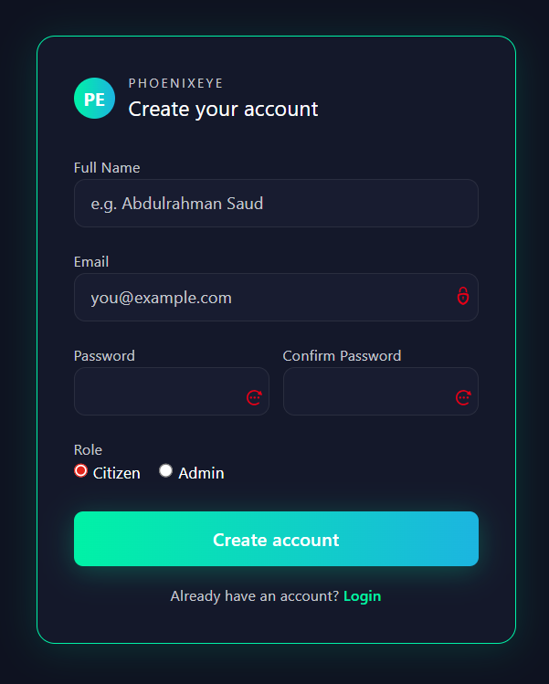
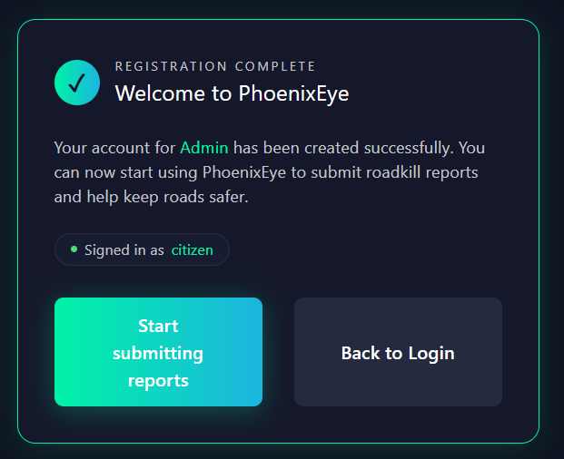
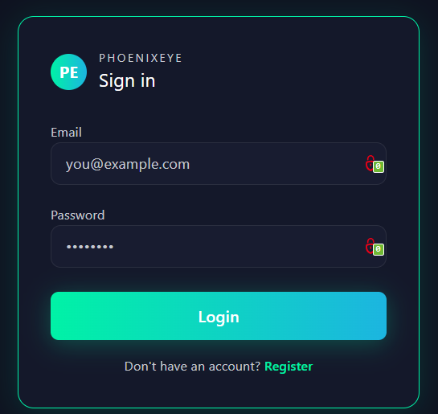
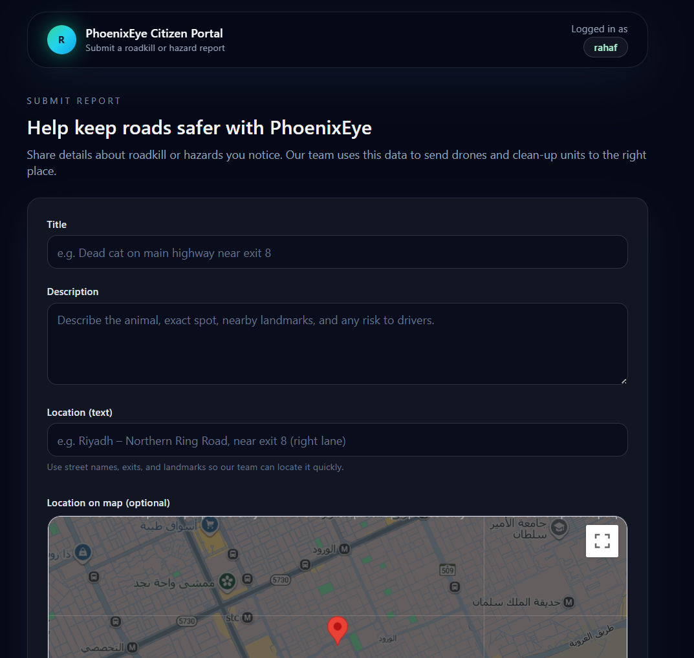
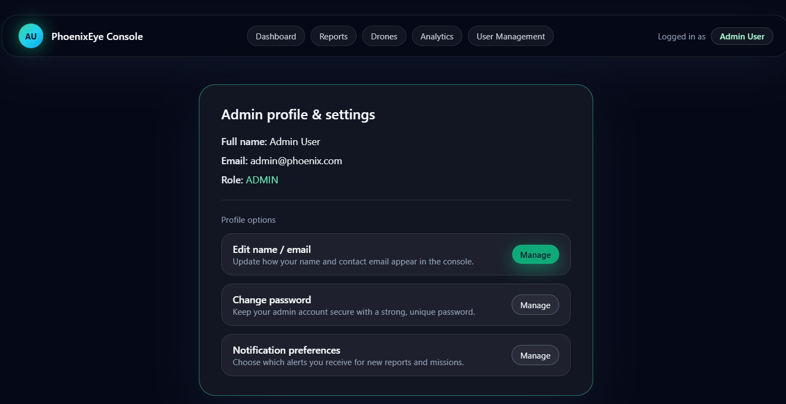
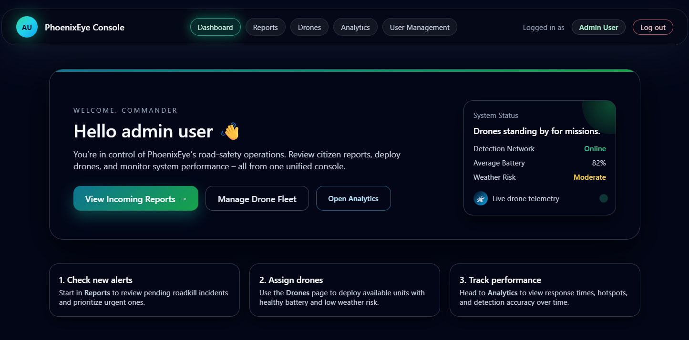
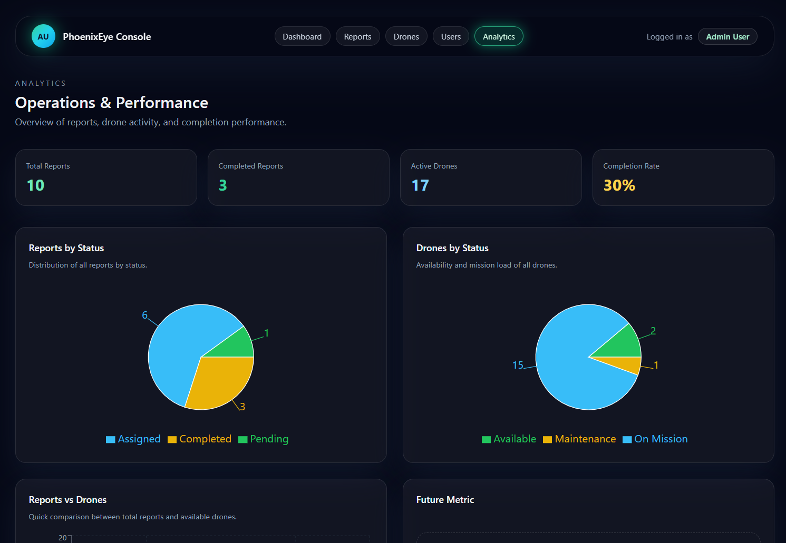

# 🦅 PhoenixEye | Smart Roadkill Detection & Management System

[](LICENSE)
[](https://react.dev/)
[](https://nodejs.org/)
[](https://www.mysql.com/)

---

## 🚦 Overview

*PhoenixEye* is an intelligent web application that helps cities keep roads cleaner and safer by detecting, reporting, and managing roadkill incidents using drone patrols, AI-assisted detection, and community participation.

- 🚗 *Operators:* Assign drones for patrols, manage live incidents, and monitor analytics.
- 👨‍👩‍👧‍👦 *Citizens:* Submit roadkill reports with photos & locations.
- 📊 *Admins:* Analyze trends, hotspots, and SLA metrics through dashboards.

---

## 📁 Project Structure


PhoenixEye/

├── backend/     
├── frontend/    
├── php/          
└── README.md


---

## 🚀 Features

- 🛰 *Drone Patrols:* Assign drones, start patrols, and live scan for incidents.
- 🗺 *Interactive Maps:* Visualize incidents and drones in real-time.
- 📷 *Photo Reports:* Upload images & locations of roadkill via citizen form.
- 🔀 *Incident Workflow:* Track status: New → Waiting → Safe → Pickup Started → Disposed.
- 📈 *Analytics Dashboard:* Weekly stats, heatmaps, and charts.
- 🛠 *Admin Panel:* Manage users, drones, and reports.
- 🌐 *Dual Backend:* Node.js for API, PHP for direct MySQL (real-time sync).

---

## 🛠 Technologies

- *Frontend:* React, Vite, Tailwind CSS
- *Backend:* Node.js, Express, JSON
- *Database:* MySQL (via PHP script)
- *Map/Charts:* Google Maps API, Recharts
- *Other:* PHP, RESTful API

---

## 💡 Quick Start

### Backend (Node.js)

bash
cd backend
npm install
npm start


### Frontend (React)
bash
cd frontend
npm install
npm run dev


### PHP/MySQL
1. Place submitReport.php in your web server (e.g., htdocs/phoenixeye/php/).
2. Create a database named phoAdmin and table reports:
   sql
   CREATE TABLE reports (
     id INT AUTO_INCREMENT PRIMARY KEY,
     location VARCHAR(255),
     description TEXT,
     photo VARCHAR(255)
   );
   ```
3. Update DB credentials in submitReport.php if needed.

---

## 🌍 Usage

- Citizen: Submit a report with photo & location.
- Operator: View and manage all reports, assign drones.
- Admin: Analyze roadkill trends with charts & maps.

---

## 🚀 Future Improvements

- 🤖 AI-Powered Image Analysis: Integrate machine learning to automatically detect and verify roadkill from drone and user-submitted photos.
- 🌍 Mobile App: Develop a cross-platform mobile application for more convenient citizen reporting and operator management.
- 🌀 Real-Time Notifications: Implement SMS, push, or email notifications for newly reported or urgent incidents.
- 📡 Advanced Drone Integrations: Enable live drone video feeds and real-time remote control for operators.
- 🛡 Role-Based Access Control: Add advanced user management and permissions for admins, operators, and citizens.
- 🗂 API Documentation & Third-Party Integration: Provide robust public APIs and documentation for integration with city management systems.
- 🧑‍🔬 Data Science Toolkit: Add predictive analytics for incident hotspots and smart scheduling of drone patrols.
- 🌱 Environmental Impact Reporting: Track and report on wildlife preservation outcomes and cleanup effectiveness.
---
---

## 🚀 UI Screenshots









---
## 📚 References
- [Tasmanian Roadkill Reporter App](https://nre.tas.gov.au/wildlife-management/living-with-wildlife/tasmanian-wildlife-roadkill/tasmanian-roadkill-reporter-app/installing-the-roadkill-reporter-app)

---

## 📄 License

This project is licensed under the [MIT License](LICENSE).

---

> 🦅 PhoenixEye — for faster cleanup, safer roads, and a healthier environment!
